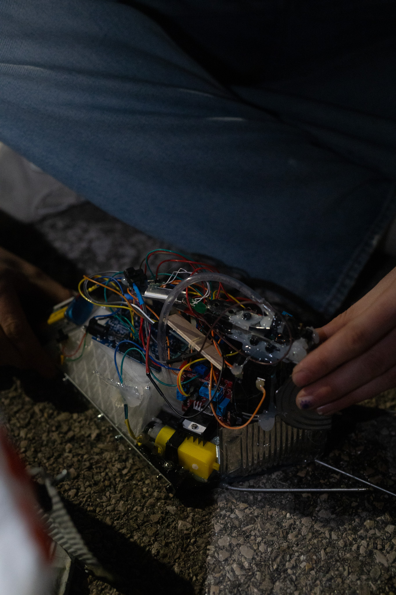
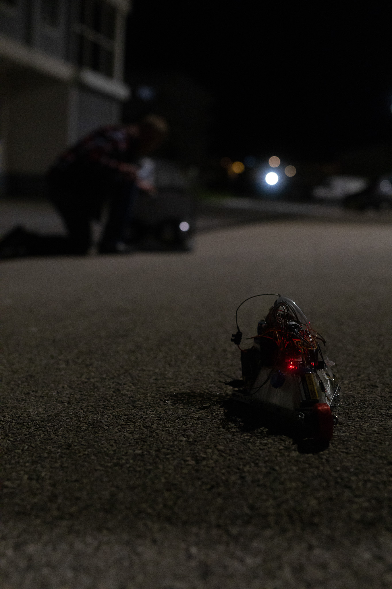

# 🔥 Flamethrower Robot – Arduino Combat Bot Project

Welcome to the **"Flamethrower Robot"** project – a Bluetooth-controlled combat robot designed to impress, intimidate (and symbolically roast 👀) its opponents in the arena. This project brings together electronics, robotics, remote control, and epic fire effects.

## 🧠 Features
- Remote control via **HC-05 Bluetooth module**
- Motorized propulsion system (H-Bridge + DC motors)
- Flamethrower module with **3D-printed fuel tank**
- Safe ignition control (activated via specific command)

## ⚙️ Hardware Used
- Arduino Uno  
- HC-05 Bluetooth module  
- L298N H-Bridge for motor control  
- 3D-printed fuel reservoir  
- Ignition system (electric arc lighter style)  
- Batteries  
- Robot chassis + wheels/motors

## 🧰 What’s the purpose?
This is an advanced robotics project aimed at:
- Learning how to integrate Arduino components  
- Experimenting with remote control systems  
- Working with a flame-based mechanism (with safety in mind)

## ⚠️ Disclaimer
This project is for **educational and experimental purposes only**. The use of any flame-based system must be done **in a secure environment**, with all necessary safety precautions.  
**Never** use this robot in uncontrolled areas or without supervision.

## 📸 Photos

